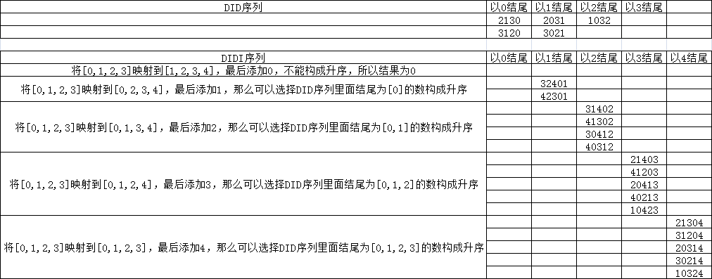

903. DI 序列的有效排列
----------
 - 题目
>给定一个长度为 n 的字符串 s ，其中 s[i] 是:
>
>“D” 意味着减少，或者
> 
>“I” 意味着增加
> 
>有效排列 是对有 n + 1 个在 [0, n]  范围内的整数的一个排列 perm ，使得对所有的 i：
>
>如果 s[i] == 'D'，那么 perm[i] > perm[i+1]，以及；
> 
>如果 s[i] == 'I'，那么 perm[i] < perm[i+1]。
> 
>返回 有效排列  perm的数量 。因为答案可能很大，所以请返回你的答案对 109 + 7 取余。
>
>
 - 示例
 ----------
> input: "DID"
> 
> 
> output: 5
 ----------
 - 代码
 >
> 
    class Solution(object):
      def numPermsDISequence(self, s):
          """
          :type s: str
          :rtype: int
          """
          n = len(s)
          MOD = 10**9+7
          # dp[i][j] 表示长度为i,结尾<=j的且满足s[:i-1]的序列个数
          dp = [[0]*(n+1) for _ in range(n+1)]
          dp[0][0] = 1
          res = 0
  
          for i in range(1,n+1):
              # 新加入了数字i
              if s[i-1]=='D':
                  dp[i][i] = 0 # 最后一个数为i时，不能构成降序
                  for j in range(i-1,-1,-1):
                      # dp[i][j+1]为直接将i加到末位
                      # dp[i-1][j]为i不在末位的可行序列
                      dp[i][j] = (dp[i][j+1]+dp[i-1][j])%MOD
              else:
                  dp[i][0] = 0 # 最后一个数为0时，不能构成升序
                  for j in range(1,i+1):
                      dp[i][j] = (dp[i][j-1]+dp[i-1][j-1])%MOD
          for j in range(n+1):
              res = (res+dp[n][j])%MOD
          return res
    
  ----------
 - 解析
 >
> 以示例为例，当已经给出了"DID"的答案，应该如何推得"DIDI"的序列；
> 
> 首先，在[0,1,2,3]的所有"DID"可行序列的基础上，加入一个4，直接加在末尾即可；
> 
> 但是这不是[0,1,2,3,4]的所有"DIDI"可行序列，还需要考虑4不在末尾的情况；
> 
> 我们可以穷举0,1,2,3,4各个数字在末尾的 "DIDI"可行序列；
> 
> 比如，要得到 3 为结尾的[0,1,2,3,4]的"DIDI"可行序列，应该怎么做？
> 
> 我们不妨将 [0,1,2,3]的"DID"可行解的3替换为4，显然，**它们仍然是可行的**，
> 
> 那如何得到所有这样的解？
> 
> 当我们要得到 以k结尾的 "DIDI"可行序列时，只要找到 将 k 替换为 4，且结尾 <k 的"DID"序列即可；
> 
  ----------
> 
> 我们将dp[i][j]定义为 使用 数字[0--i]，得到的 s[:i-1]可行序列，且最后一位<=j 的所有序列的个数；
> 

>
>
> 
    for i in range(1,n+1):
      # 新加入了数字i
      if s[i-1]=='D':
          dp[i][i] = 0 # 最后一个数为i时，不能构成降序
          for j in range(i-1,-1,-1):
              # dp[i][j+1]为直接将i加到末位
              # dp[i-1][j]为i不在末位的可行序列
              dp[i][j] = (dp[i][j+1]+dp[i-1][j])%MOD
      else:
          dp[i][0] = 0 # 最后一个数为0时，不能构成升序
          for j in range(1,i+1):
              dp[i][j] = (dp[i][j-1]+dp[i-1][j-1])%MOD
>
> 可以看到，代码中要枚举 结尾为 0--i-1 的所有可行 s[:i-2]序列时，只是叠加了dp[i-1][j]/dp[i-1][j-1]
> 
> 可以看图，这是因为计算过程中，会将结果叠加，因此 dp[i-1][j]/dp[i-1][j-1]就包含了结尾 从(0--j-1)/(n--j+1)的所有可行 s[:i-2]序列
> 