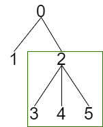

834.树中距离之和
----------
 - 题目
>给定一个无向、连通的树。树中有 N 个标记为 0...N-1 的节点以及 N-1 条边 。

>第 i 条边连接节点 edges[i][0] 和 edges[i][1] 。

>返回一个表示节点 i 与其他所有节点距离之和的列表 ans。
 - 示例
 ----------
>input: N = 6, edges = [[0,1],[0,2],[2,3],[2,4],[2,5]]

> output: [8,12,6,10,10,10] 
 ----------
 - 代码
 >
>
    class Solution:
        def sumOfDistancesInTree(self, N: int, edges: List[List[int]]) -> List[int]:
            graph = {i:[] for i in range(N)}
            # 建立邻接关系表
            for edge in edges:
                graph[edge[0]].append(edge[1])
                graph[edge[1]].append(edge[0])
    
            # 任意节点子树中节点的总个数(包括自己)
            nodeNum = [1]*N
            # 任意节点的距离和
            distSum = [0]*N
    
            # 求任意节点的子树中的所有距离和
            def postOrder(root,parent):
                neighbors = graph[root]
                for neighbor in neighbors:
                    # 父节点不用求
                    if neighbor==parent:
                        continue
                    postOrder(neighbor,root)
                    nodeNum[root] += nodeNum[neighbor]
                    distSum[root] += nodeNum[neighbor]+distSum[neighbor]
    
            # 求子树外的所有距离和
            def preOrder(root,parent):
                neighbors = graph[root]
                for neighbor in neighbors:
                    if neighbor==parent:
                        continue
                    distSum[neighbor] = distSum[root]-nodeNum[neighbor]+(N-nodeNum[neighbor])
                    preOrder(neighbor,root)
            
            
            postOrder(0,-1)
            # print(distSum)
            # print(nodeNum)
            preOrder(0,-1)
            
            return distSum
 
  ----------
 - 解析
 >
> 对于任意节点，其所有距离，可以分为两个部分： 该节点的子树下的所有节点，该节点子树外的所有节点；
>
> 我们将整个求解过程也分成这两个部分进行求解；
>
  ----------
> 对于任意节点的子树下的所有节点;
> 
> 其求解是容易的，只要dfs遍历子树所有节点，并记录下每个节点对应的层次（即距离目标节点的距离），累加即可；
>
> 由于求解某个节点到目标节点的距离，需要先求得该节点的子树下的节点到目标节点的距离，所以求解过程是递归的；
> 
    def postOrder(root,parent):
        neighbors = graph[root]
        for neighbor in neighbors:
            # 父节点不用求
            if neighbor==parent:
                continue
            # 先求该邻居的 子树距离和
            postOrder(neighbor,root)
            # 根节点累加这个距离即可
            nodeNum[root] += nodeNum[neighbor]
            distSum[root] += nodeNum[neighbor]+distSum[neighbor]
> 
> 如果单纯计算距离，需要记录目标节点与其子树中任意节点的层次差，这是比较麻烦的；
>
> 这里用nodeNum这个量来替代层次的计算；
>
> 那么为什么
>
    nodeNum[root] += nodeNum[neighbor]
    distSum[root] += nodeNum[neighbor]+distSum[neighbor]
> 
> 就能计算root的子树的距离总和？
> 
> 以为题给的示例为例；
>

>
> 经过postOrder之后，得到的distSum，nodeNum分别为 [8, 0, 3, 0, 0, 0], [6, 1, 4, 1, 1, 1]
>
> 按照postOrder的执行顺序，会先遍历到["3","4","5"]节点，然后自下而上计算两个数组的结果；
>
> 计算到"2"节点时，其nodeNum变为4，distSum变为3；
>
> 这是由于，将["3","4","5"]走到2，分别需要经过它们之间相连的那条路径，即nodeNum[neighbor]
>
> 而之后计算"0"节点时，nodeNum[2]+distSum[2]，实际上算了"2”包括其子树的所有节点到"0"的距离；
>
> 可以这么理解，首先将"2"以及其子树的节点走到"2"节点，这需要多少步？
>
> 显然，是distSum[2]对应的3步；
>

>
> 而后，将这些节点走到"0"节点需要多少步骤？
>

>
> 显然，它们需要经过图上的红色路径，一共有4个节点，因此未nodeNum[2]；
>
> 对于任意节点的计算，可以这么理解，与postOder的自下而上递归过程一致；
>
  ----------
>
> 对于子树外的节点，并不容易直接求解；
>
> 但是，由于postOrder已经求解了所有节点的子树距离总和，子**树外的距离总和，实际上并不需要求解**；
>
> 显然，根节点的distSum已经是正确的了（因为它没有子树外的节点）；我们利用这个，可以求解任意节点的子树外的距离总和；
>
> 对于任意节点，要求取子树外的节点，可以这么康： 子树外的节点**与其父节点**（根节点）的距离+根节点与节点"2"的距离；
>
> 这需要其父节点的正确的distSum，因此必须自上而下，从根节点开始求取；
>
>

>
> 以节点"2"为例，定义"2"的父节点为"2-root"
>
> 其子树外的节点个数为 N-nodeNum[2]；
>
> 子树外的节点距离和，其实包含在了distSum[父节点(2-root)]里面了，而这些节点，从父节点移动到节点"2"需要走动 N-nodeNum[2]步；
>
> 而distSum[root]中，包含了从"2-root"到 "2"的子树中所有节点的距离；
>
> 因此需要扣除一次"2-root"到"2"的距离，"2"的子树中一共有nodeNum[2]个，所以减去 nodeNum[2]；
>
    # 求子树外的所有距离和
    def preOrder(root,parent):
        neighbors = graph[root]
        for neighbor in neighbors:
            if neighbor==parent:
                continue
            distSum[neighbor] = distSum[root]-nodeNum[neighbor]+(N-nodeNum[neighbor])
            preOrder(neighbor,root)
> 
> 自上而下求解，因此采用前序遍历；