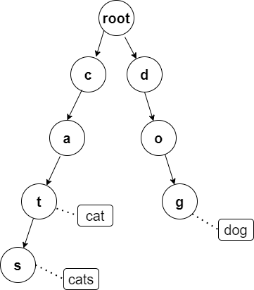

>
> 如图所示，前缀树（字典树）是将单词（或其他元素)按照前缀的形式进行存储；
>
> 图中，圆的节点表示分支，方框表示叶子节点（即单词）；该树中存放了三个单词，[cat,cats,dog]；
>
> 这样的形式下，对于某个单词的查询，只要从上到下遍历这颗树就行，同时也能检测单词的前缀/后缀等； 其查询复杂度只和输入的单词长度有关；
>
>

>
> 对于字典树的存储，通常采用字典，字典可以层层包裹，正好适合这种n叉树的结构；
>
>python
>
    class Trie:
        def __init__(self):
            """
            Initialize your data structure here.
            """
            self.lookup = {}
    
        def insert(self, word: str) -> None:
            """
            Inserts a word into the trie.
            """
            tree = self.lookup
            for a in word:
                # 如果该字符不存在，建立新的节点
                if a not in tree:
                    tree[a] = {}
                # 进入该字符对应的节点
                tree = tree[a]
            # 加入叶子节点标记，叶子节点的值可以按需设计
            tree['#'] = word
    
    
        def search(self, word: str) -> bool:
            """
            Returns if the word is in the trie.
            """
            tree = self.lookup
            for a in word:
                # 如果某个单词的某个字符在查询过程中断了，说明该单词不在该树中
                if a not in tree:
                    return False
                tree = tree[a]
            # 如果该单词的最后一个字符对应的节点没有叶子节点，说明该单词不在该树中
            if '#' in tree:
                return True
            return False
    
        def startsWith(self, prefix: str) -> bool:
            """
            Returns if there is any word in the trie that starts with the given prefix.
            """
            tree = self.lookup
            for a in prefix:
                if a not in tree:
                    return False
                tree = tree[a]
            return True
>
>java
>
    public class TrieNode{
        public int path; //当前节点链接到的其他节点的个数
        public int end;  //表示以当前节点为结尾的单词的个数
        public HashMap<Character,TrieNode> next;  //链接的节点列表
        public TrieNode(){
            path = 0;
            end = 0;
            next = new HashMap<>();
        }
    }
    
    class Trie {
        private TrieNode root;
        /** Initialize your data structure here. */
        public Trie() {
            root = new TrieNode();
        }
        
        /** Inserts a word into the trie. */
        public void insert(String word) {
            if(word==null||word.equals("")) return;
            TrieNode node = root;
            for(int i=0;i<word.length();i++){
                char ch = word.charAt(i);
                if(!node.next.containsKey(ch)){
                    node.next.put(ch,new TrieNode());
                }
                node = node.next.get(ch);
                node.path++; //这个节点上的分支数量+1
            }
            node.end++; //这个节点上的单词数量+1
        }
        
        /** Returns if the word is in the trie. */
        public boolean search(String word) {
            if(word == null || word.equals("")) return false;
            TrieNode node = root;
            for(int i=0;i<word.length();i++){
                char ch = word.charAt(i);
                if(!node.next.containsKey(ch)) return false;
                node = node.next.get(ch);
            }
            // 没有以这个节点结尾的单词
            if(node.end==0) return false;
            return true;
        }
        
        /** Returns if there is any word in the trie that starts with the given prefix. */
        public boolean startsWith(String word) {
            if(word == null || word.equals("")) return false;
            TrieNode node = root;
            for(int i=0;i<word.length();i++){
                char ch = word.charAt(i);
                if(!node.next.containsKey(ch)) return false;
                node = node.next.get(ch);
            }
            return true;
        }
    }