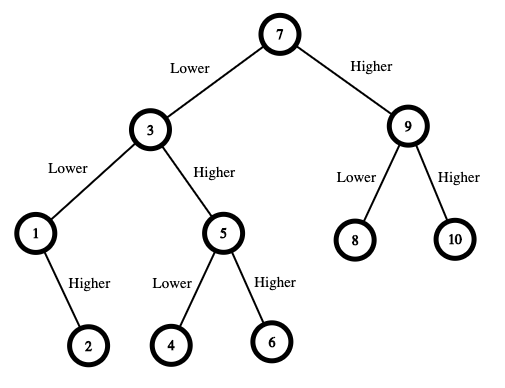

375.猜数字大小2.md
----------

 - 题目
> 我们正在玩一个猜数游戏，游戏规则如下：
>
> 我从 1 到 n 之间选择一个数字。
> 
> 你来猜我选了哪个数字。
> 
> 如果你猜到正确的数字，就会 赢得游戏 。
> 
>如果你猜错了，那么我会告诉你，我选的数字比你的 更大或者更小 ，并且你需要继续猜数。
> 
>每当你猜了数字 x 并且猜错了的时候，你需要支付金额为 x 的现金。如果你花光了钱，就会 输掉游戏 。
> 
>给你一个特定的数字 n ，返回能够 确保你获胜 的最小现金数，不管我选择那个数字 。
>
----------
 - 示例
> 
> input: n=10
> 
> output: 16
> 
> 

> 
> 
    制胜策略如下：
- 数字范围是 [1,10] 。你先猜测数字为 7 。
    - 如果这是我选中的数字，你的总费用为 $0 。否则，你需要支付 $7 。
    - 如果我的数字更大，则下一步需要猜测的数字范围是 [8,10] 。你可以猜测数字为 9 。
        - 如果这是我选中的数字，你的总费用为 $7 。否则，你需要支付 $9 。
        - 如果我的数字更大，那么这个数字一定是 10 。你猜测数字为 10 并赢得游戏，总费用为 $7 + $9 = $16 。
        - 如果我的数字更小，那么这个数字一定是 8 。你猜测数字为 8 并赢得游戏，总费用为 $7 + $9 = $16 。
    - 如果我的数字更小，则下一步需要猜测的数字范围是 [1,6] 。你可以猜测数字为 3 。
        - 如果这是我选中的数字，你的总费用为 $7 。否则，你需要支付 $3 。
        - 如果我的数字更大，则下一步需要猜测的数字范围是 [4,6] 。你可以猜测数字为 5 。
            - 如果这是我选中的数字，你的总费用为 $7 + $3 = $10 。否则，你需要支付 $5 。
            - 如果我的数字更大，那么这个数字一定是 6 。你猜测数字为 6 并赢得游戏，总费用为 $7 + $3 + $5 = $15 。
            - 如果我的数字更小，那么这个数字一定是 4 。你猜测数字为 4 并赢得游戏，总费用为 $7 + $3 + $5 = $15 。
        - 如果我的数字更小，则下一步需要猜测的数字范围是 [1,2] 。你可以猜测数字为 1 。
            - 如果这是我选中的数字，你的总费用为 $7 + $3 = $10 。否则，你需要支付 $1 。
            - 如果我的数字更大，那么这个数字一定是 2 。你猜测数字为 2 并赢得游戏，总费用为 $7 + $3 + $1 = $11 。
在最糟糕的情况下，你需要支付 $16 。因此，你只需要 $16 就可以确保自己赢得游戏。
----------
- 代码
>
> dfs(超时)
> 
    class Solution:
        def getMoneyAmount(self, n: int) -> int:
            # min max 问题
            # 找到 所有 二分搜索树最长路径(到叶节点的上一层) 里面值最小的那个 路径值
            res = []
            for i in range(1,n+1):
                res.append(self.findMaxPath(i,n))
                print(res)
            return min(res)
    
            # print(self.findMaxPath(9,n))
            # return 0
    
        def findMaxPath(self,rootValue,n):
            maxPath = 0
            def dfs(left,right,root):
                #print(left,right,root,curValue)
                nonlocal maxPath
                if left>=right: return 0
                # 左半
                leftPath = dfs(left,root-1,(left+root-1)//2)
                # 右半
                rightPath = dfs(root+1,right,(root+1+right)//2)
                maxP = max(leftPath,rightPath)
                maxP += root
                maxPath = max(maxPath,maxP)
                return maxP
            return dfs(1,n,rootValue)
>
> dp
> 
    class Solution:
        def getMoneyAmount(self, n: int) -> int:
            # dp[i][j] 表示数字范围(i,j)中 确保获胜的 最小现金数
            dp = [[0]*(n+1) for _ in range(n+1)]
            for i in range(n-1,0,-1):
                for j in range(i+1,n+1):
                    dp[i][j] = float('inf')
                    # dp[i][j] 将取决于如何将 k的左右两边进行组合
                    for k in range(i,j):
                        dp[i][j] = min(dp[i][j],k+max([dp[i][k-1],dp[k+1][j]]))
            return dp[1][n]
----------
> 
> 题目看不懂，给你明确一下意思；
> 
> 