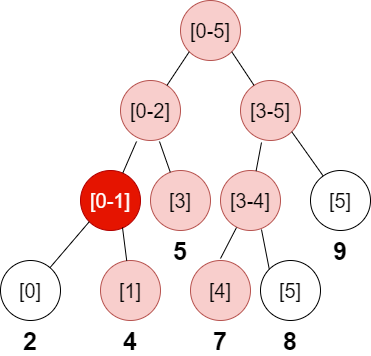

307.区域和检索-数组可修改
----------
 - 题目
>给定一个整数数组  nums，求出数组从索引 i 到 j  (i ≤ j) 范围内元素的总和，包含 i,  j 两点。

> update(i, val) 函数可以通过将下标为 i 的数值更新为 val，从而对数列进行修改。

 - 示例
 ----------
>Given nums = [1, 3, 5]

>sumRange(0, 2) -> 9
>
>update(1, 2)
>
>sumRange(0, 2) -> 8
>
 ----------
 - 代码
 > 线段树
>
    class NumArray:
        def __init__(self, nums: List[int]):
            self.n = len(nums)
            self.tree = [0]*(self.n*2)
            # initialization
            for i in range(self.n):
                self.tree[self.n+i] = nums[i]
            for i in range(self.n-1,-1,-1):
                self.tree[i] = self.tree[i*2]+self.tree[2*i+1]
            #print(self.tree)
    
        def update(self, i: int, val: int) -> None:
            i+=self.n
            self.tree[i] = val
            while i>0:
                left = i
                right = i
                # 当前节点是其父节点的左还是右儿子
                if i%2==0:
                    right = i+1
                else:
                    left = i-1
                self.tree[i//2] = self.tree[left]+self.tree[right]
                i//=2
    
        def sumRange(self, i: int, j: int) -> int:
            # 初始位置都是叶节点
            i+=self.n
            j+=self.n
            res = 0
            while i<=j:
                # 左范围的特殊处理
                if i%2==1:
                    res+=self.tree[i]
                    # 自己是右子节点，忽略左兄弟
                    i+=1
                # 右范围的特殊处理
                if j%2==0:
                    res+=self.tree[j]
                    # 自己是左子节点，忽略右兄弟
                    j-=1
                i//=2
                j//=2
            return res
>
> 树状数组
> 
    class TreeArr:
        def __init__(self,n):
            self.n = n
            self.tree = [0]*(n+1)
    
        def lowbit(self,x):
            return x&-x
        
        def query(self,x):
            # 查询前缀和
            ans = 0
            i = x
            while i>0:
                ans += self.tree[i]
                i-=self.lowbit(i)
            return ans
    
        def queryRange(self,x,y):
            return self.query(y+1)-self.query(x)
    
        def add(self,x,u):
            i = x
            while i<=self.n:
                self.tree[i]+=u
                i+=self.lowbit(i)
            return
    
    class NumArray:
    
        def __init__(self, nums: List[int]):
            self.nums = nums
            n = len(nums)
            self.tree = TreeArr(n)
            for i in range(n):
                self.tree.add(i+1,nums[i])
    
        def update(self, index: int, val: int) -> None:
            self.tree.add(index+1,val-self.nums[index])
            self.nums[index] = val
    
        def sumRange(self, left: int, right: int) -> int:
            return self.tree.queryRange(left,right)
    
    
    # Your NumArray object will be instantiated and called as such:
    # obj = NumArray(nums)
    # obj.update(index,val)
    # param_2 = obj.sumRange(left,right)
 ----------
 - 解析
 > 
> 线段树的创建和更新不再赘述，主要考虑范围和的求解；
> 
> 范围累加其实是对线段树节点的层层累加；
>
> 可能会想，只要将两个范围逐步收缩（即i//2,j//2），当二者相遇，就得到了[i,j]范围的和（因为分支节点表示一定范围的和，所以相遇的节点会包含它们的范围）；
>
> 但是，由于这个节点对应的范围包含了下层直到叶节点的所有**左右子节点**，所以实际上不能全部累加。
>

>
> 如图所示，以数组[2,4,5,7,8,9]为例，当求取索引范围是[1--4]即子数组[4,5,7,8]时候，会沿着图中标红的节点向上求解；
>
>显然，对于左边界收缩时，当左边界是一个右子节点时，要忽略它的左兄弟；
>
    if i%2==1:
        res+=self.tree[i]
        # 自己是右子节点，忽略左兄弟
        i+=1
>
> 而判断是否为右子节点很简答，因为右子节点总是出现在奇数索引上；
>
> 而忽略左兄弟的操作，就是i+=1；如果这里不执行i+=1,节点上行后，下一轮会指向[0-1]那个节点，这样在下轮计算的时候，由于该节点的值实际上包含了索引[0]的值，与要求的范围[1--4]不符合；
>

>
> 实际上，下一轮要加入的节点应该是[3]节点，而(i+1)//2正好能让指针指向该节点
>

>
>
>同理，右边界是左子节点时要忽略它的右兄弟；
>
    if j%2==0:
        res+=self.tree[j]
        # 自己是左子节点，忽略右兄弟
        j-=1
> 因此这里是j-=1;
 ----------
>
> 单点修改，区间查询，典型的树状数组应用场景，可以看树状数组的解析；