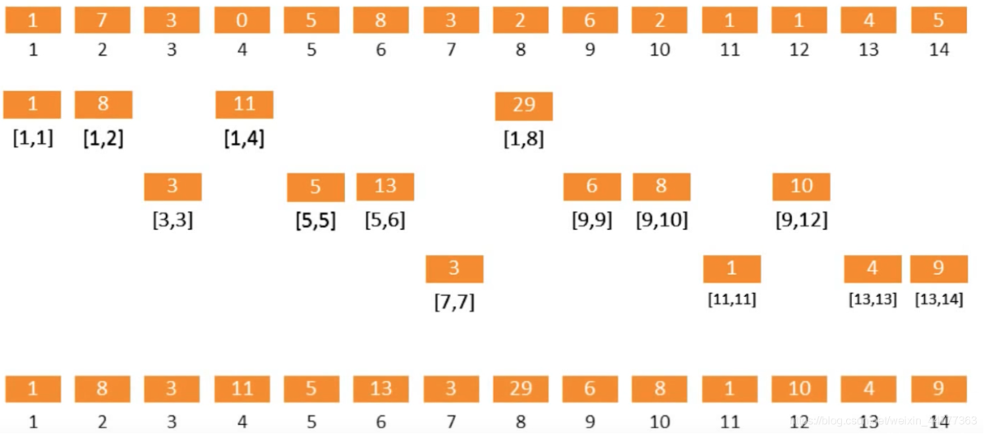
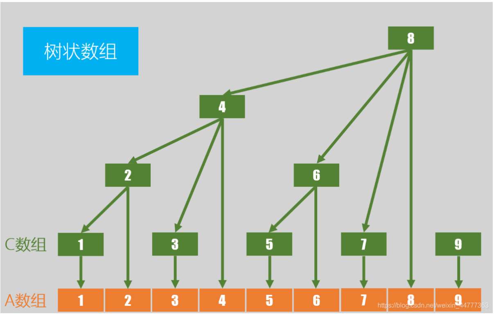

> 树状数组旨在解决 **修改单点，查询区间** 这类问题；
>
> 是一种能搞高效求得**前缀和**以及**区间和**的数据结构；
> 
> 查询和修改的复杂度都是O(logn)；
> 
----------
>
> 首先解释如何把一个普通数组变为一个树状数组
> 

>
> 图中最上面一行是原始数组A，最下面一行为树状数组C；
> 
    1 = (001), C[1] = A[1];
    2 = (010), C[2] = A[1]+A[2];
    3 = (011), C[3] = A[3];
    4 = (100), C[4] = A[1]+A[2]+A[3]+A[4];
    5 = (101), C[5] = A[5];
    ...
>
> 引入一个概念 lowbit，lowbit(x)指的是**x右边往左看第一个1以及它之后的0组成的数字**；
> 
> 例如 lowbit(6) = lowbit(110) = 10，这个结论是由二进制码计算得到的，姑且不讨论原理，知道结论即可；
> 
    def lowbit(self,x):
        return x&-x
>
> 然后根据上面的图可以看出；
> 
> C[i]里面存储的是 A[i-lowbit(i)+1]+A[i-lowbit(i)+2]+...A[i]，即原数组中**下标i-lowbit(i)到i的元素的区间和**
>
    tip：所以如果x的右边第一个1出现在末位，那就会有C[x]=A[x]；
>
> 再引用大佬的一个图，就很好理解了
> 

>
> 于是，当我们要求前缀和A[:i]的时候；
> 
    def query(self,x):
        # 查询前缀和
        ans = 0
        i = x
        while i>0:
            ans += self.tree[i]
            i-=self.lowbit(i)
        return ans
>
> 第一次求 A[i-lowbit(i)+1]+...A[i]；第二次求A[i-lowbit(i)-lowbit(i-lowbit(i))]+...A[i-lowbit(i)]；
> 
> 这样从后往前求，这是树状数组的存储性质决定的；
> 
> 如果要求A[i:j]，那么求两次前缀和，然后相减就行了；
> 
> 这样求前缀和的效率大约为O(logn)；
> 
> 如果要修改原数组A中的某个数组，就要修改它相关的所有C中的元素；
> 
    def add(self,x,u):
        i = x
        while i<=self.n:
            self.tree[i]+=u
            i+=self.lowbit(i)
        return
>
> 同理，第一次是将C中代表A[i]+...A[i+lowbit(i)]的元素加上u，。。。。；
> 
> 实际上参照上面第二个图就比较容易理解了；
> 
----------
> 然后这个树状数组还有一个神奇的应用。。。（参考逆序对那题）
> 
> 假设用原数组A表示数据的存在性，即A[i]=1表示目标数据中存在i这个值；
> 
> 那么我们可以用A对应的树状数组C来快速求取前缀和；
> 
> 这个前缀和有什么用呢？
> 
> 它代表了i前面的数字的存在性，具体可以参考493以及1395两题