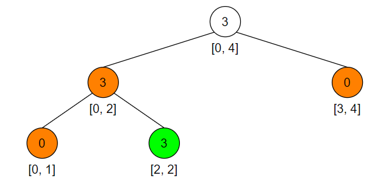
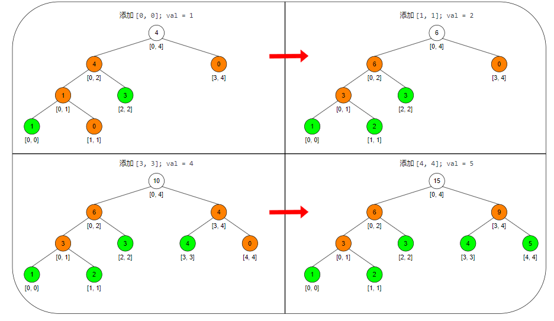

> 静态线段树（固定大小）要求先开好存储节点的数组，更新和查询的操作相对简单；
> 
> 但是对于某些数据范围超大的问题，无法先开好存储空间的，就需要动态开点了；
>
> 动态开点即在更新过程中**创建节点**；
>
> 因此一开始的时候，线段树实际上是空的；
> 
> 假如此时，加入一个元素[2,2]
> 

>
> 加入的过程会把中继节点和不存在的叶子节点给创建出来
>
> 更新节点的代码：
> 
    # start,end表示当前节点代表的数据范围，l,r表示要更新的数据范围
    def update(node,start,end,l,r,val):
        # 当前节点范围属于要更新的范围
        if l<=start and end<=r:
            # 更新当前节点的值，由于是计算范围和，所以要加上所有叶节点的更新值，即 叶节点数量*更新值
            node.val += (end-start+1)*val
            # 该节点的懒标记，会在pushDown的过程中向下传递
            node.add += val 
            # 这里return了，但是其实是要更新当前节点的子节点的（因为他们属于当前节点对应的范围）；
            # 但是这里用了懒标记，只有下次用到这些子节点时，懒标记才会向下传导到它们，这里节约了时间开销；
            return
        # 如果当前节点的范围超过了要更新的范围，则需要向下找到要更新的节点
        mid = (start+end)//2
        # 下推标记
        pushDown(node,mid-start+1,end-mid)
        # 这表示查询区间无法cover节点区间，因此向下递归，进行更新
        if l<=mid:
            update(node.left,start,mid,l,r,val)
        if r>mid:
            update(node.right,mid+1,end,l,r,val)
        # 向上更新
        pushUp(node)
> 
> 这里把代码对应上图中的流程：
> 
    1. 刚开始只有一个节点，代表整个数据范围 [0,4]，val = 0
    2. 下推标记过程，创建了根节点的两个子节点[0,2]以及[3,4]
    3. 进入[0,2]的更新流程（[3,4]在[2,2]的更新范围外了，所以不进行处理）
    4. 下推[0,2]的标记，创建了两个子节点[0,1]，[2,2]
    5. 更新[2,2]的值（[0,1]在范围外面）
    6. 一路向上更新，最终得到图中的样子
>
> 下推过程具体需要做什么：
> 
>   
    # 左右子节点区间内的叶子节点个数
    def pushDown(node,leftNum,rightNum):
        # 没右左右孩子，开点
        if node.left is None:
            node.left = Node()
        if node.right is None:
            node.right = Node()
        # 没有标记需要传递
        if node.add == 0:
            return
        # 为左右子节点值进行变更
        node.left.val += node.add*leftNum
        node.right.val += node.add*rightNum
        # 下推标记（孩子节点可能还有别的标记没有被使用，所以是累加的）
        node.left.add += node.add
        node.right.add += node.add
        # 向下传递了，所以取消本节点的标记
        node.add = 0
> 
> 后续加入其他四个数的流程如下图
> 

>
> 这个懒惰标记 add 是用来做什么的？
> 
> 就是暂时给某个范围做一个标记（例如表示该范围的数都加上了x），然后仅在使用到这个范围内的值时，才向下传播，将数据的变更响应到叶子节点上；
> 
> 也即，对于每次区间的修改和查询，才将懒惰标记向下传递；
> 
> 查询
>
    def query(node,start,end,l,r):
        # 查询区间[l,r]完全包含节点区间[start,end]
        if l<=start and end<=r:
            return node.val
        mid = (start+end)//2
        ans = 0
        pushDown(node,mid-start+1,end-mid)
        if l<=mid:
            ans+=query(node.left,start,mid,l,r)
        if r>mid:
            ans+=query(node.right,mid+1,end,l,r)
        return ans
>
> 具体来说，线段树的运用还分几种类型：
> 
> 区间最值（699.掉落的方块），区间和()，数据存在性（715.Range模块）；
> 