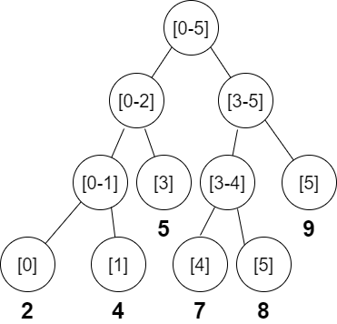

> 线段树求解的题目有一个特点，就是**区间动态改变，且求取目标是区间性质的**，如果不满足这些，尽量用并查集、差分数组等来求；
>
> 线段树常常用来解决范围查询问题，比如从数组中找到 最大/小值，总和，最大公约数，最小公倍数等；
>

>
> 如图所示，树中每个节点都包含了数组的一个子范围上的**聚合**信息（最大值，最小值。。。），其左，右子节点分别包含了[i,...(i+j)//2],[(i+j)//2+1,...j]范围上的信息；
>
>树的叶子节点，包含的是数组中的每个元素，即范围为[i,i]的信息；
>
> 如果用数组来表示二叉树；
>
> 对于数组索引 i， 如果其对应元素不是一个叶节点，则其左，右节点分别位于索引 2*i,2*i+1 上；
> 
> 可以按照如下方式构建线段树；
>
> 特别需要注意，因为要存储分支节点，所以总的要存储的元素个数是(2n-1)个，因此建立大小为2n的数组，并且将数组元素放置在[n--2n-1]的索引上；
>
> 至于具体应用，可以参考各例题
>
> java
>
    int[] tree;
    int n;
    public NumArray(int[] nums){
        if(nums.length>0){
            n = nums.length;
            tree = new int[n*2];
            buildTree(nums);
        }
    }
    private void buildTree(int[] nums){
        # 初始化叶节点
        for(int i=n,j=0;i<2*n;i++,j++)
            tree[i] = nums[j];
        # 填充分支节点
        for(int i=n-1;i>0;--i)
            tree[i] = tree[i*2]+tree[i*2+1];
    }
    void update(int pos,int val){
        # 更新的是nums中的数据，所以对应的索引要+n；
        pos+=n;
        tree[pos] = val;
        # 自下而上更新相关的节点
        while(pos>0){
            int left = pos;
            int right = pos;
            # 如果当前节点是父节点的左子节点，则他的兄弟节点为父节点的右子节点
            if(pos%2==0){
                right = pos+1;
            }else{
                # 与上面相反
                left = pos-1;
            }
            tree[pos/2] = tree[left]+tree[right];
            pos/=2;
        }
    }
>
> python
>
    class NumArray:
        def __init__(self, nums: List[int]):
            self.n = len(nums)
            self.tree = [0]*(self.n*2)
            # initialization
            for i in range(self.n):
                self.tree[self.n+i] = nums[i]
            for i in range(self.n-1,-1,-1):
                self.tree[i] = self.tree[i*2]+self.tree[2*i+1]
            #print(self.tree)
    
        def update(self, i: int, val: int) -> None:
            i+=self.n
            self.tree[i] = val
            while i>0:
                left = i
                right = i
                # 当前节点是其父节点的左还是右儿子
                if i%2==0:
                    right = i+1
                else:
                    left = i-1
                self.tree[i//2] = self.tree[left]+self.tree[right]
                i//=2

