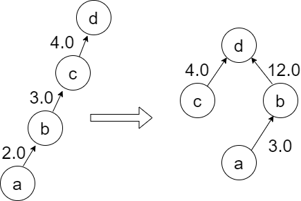
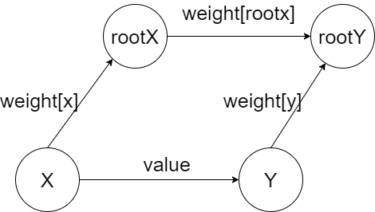

399.除法求值
----------
 - 题目
>给你一个变量对数组 equations 和一个实数值数组 values 作为已知条件，其中 equations[i] = [Ai, Bi] 和 values[i] 共同表示等式 Ai / Bi = values[i] 。每个 Ai 或 Bi 是一个表示单个变量的字符串。

>另有一些以数组 queries 表示的问题，其中 queries[j] = [Cj, Dj] 表示第 j 个问题，请你根据已知条件找出 Cj / Dj = ? 的结果作为答案。

>返回 所有问题的答案 。如果存在某个无法确定的答案，则用 -1.0 替代这个答案。
 - 示例
 ----------
>input: equations = [["a","b"],["b","c"]], values = [2.0,3.0], queries = [["a","c"],["b","a"],["a","e"],["a","a"],["x","x"]]

> output: [6.00000,0.50000,-1.00000,1.00000,-1.00000] 
 ----------
 - 代码
 >
>
    class UF:
        def __init__(self,n):
            self.parent = [i for i in range(n)]
            self.values = [1]*n
        def find(self,x):
            if x!=self.parent[x]:
                origin = self.parent[x]
                # 找到最上面的根节点
                self.parent[x] = self.find(self.parent[x])
                # 计算边权重
                self.values[x]*=self.values[origin]
            return self.parent[x]
        def union(self,x,y,value):
            rootX = self.find(x)
            rootY = self.find(y)
            if rootX==rootY:
                return
            self.parent[rootX] = rootY
            self.values[rootX] = self.values[y]*value/self.values[x]
        def isConnected(self,x,y):
            rootX = self.find(x)
            rootY = self.find(y)
            if rootX==rootY:
                return self.values[x]/self.values[y]
            return -1
    class Solution:
        def calcEquation(self, equations: List[List[str]], values: List[float], queries: List[List[str]]) -> List[float]:
            charIndex = {}
            uf = UF(len(equations)*2)
            index = 0
            # 遍历变量关系，放入并查集；
            for i in range(len(equations)):
                var1 = equations[i][0]
                var2 = equations[i][1]
                if var1 not in charIndex:
                    charIndex[var1] = index
                    index+=1
                if var2 not in charIndex:
                    charIndex[var2] = index
                    index+=1
                uf.union(charIndex[var1],charIndex[var2],values[i])
            res = []
            # 对于queries，只要查询两变量之间是否有联系即可；
            for i in range(len(queries)):
                var1 = queries[i][0]
                var2 = queries[i][1]
    
                if var1 not in charIndex or var2 not in charIndex:
                    res.append(-1)
                    continue
                res.append(uf.isConnected(charIndex[var1],charIndex[var2]))
            return res
 ----------
 - 解析
 > 显然，对于变量之间的关系，应该以图的形式表示，节点表示变量，边表示比例关系，边的权重表示比值；
>
> 如图所示;
>

>
> "a->b" 的边表示 'a/b=2.0';
>
> 因为存在'b/c'以及'c/d'的关系，所以'b/d=b/c*(c/d)' 所以'b/d=3.0*4.0=12.0';
>
> 对应代码中的节点合并过程；
>
    def find(self,x):
        if x!=self.parent[x]:
            origin = self.parent[x]
            self.parent[x] = self.find(self.parent[x])
            self.values[x]*=self.values[origin]
> 向上查找时同时合并，并将边的权重连乘；
> 
> 对于两个节点合并的情况；
> 
    def union(self,x,y,value):
        rootX = self.find(x)
        rootY = self.find(y)
        if rootX==rootY:
            return
        self.parent[rootX] = rootY
        self.values[rootX] = self.values[y]*value/self.values[x]
>
> 对于x的根节点和y的根节点，在查找过程中，x和y会分别被直接挂在这两个节点下；
>
> 如果两者的根节点相同，则不需要合并；
>
> 合并的时候，需要考虑两者的边的权重；
>

>
> 如图所示，是合并之后的关系图，显然，有：
>
    weight[x]*weight[rootX] = value*weight[y]
    weight[rootX] = weight[y]*value/weight[x]
>