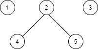
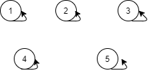
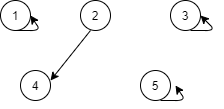
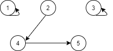
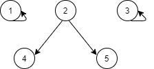

> 并查集主要用于解决一些元素分组的问题，可以管理一系列不相交的集合；
>
> 尤其对于求解图的**连通子图问题**，特别合适；
> 
>
> 并查集的主要思想在于，用森林来表示元素分组的关系；
>
> 并查集通常包含两个操作：查找，合并
>
>python

    class UF:
        def __init__(self,count):
            self.count = count
            self.parent = [i for i in range(count)]
        def find(self,x):
            # 查询根节点
            while x!=self.parent[x]:
                self.parent[x] = self.parent[self.parent[x]]
                x = self.parent[x]
            return x
        def union(self,p,q):
            rootP = self.find(p)
            rootQ = self.find(q)
            # 两个节点同属于一棵树，不用合并（这表示出现环了）
            if rootP==rootQ:
                return
            # 两个节点属于不同的树，由于它们相互连通，所以将对应的树进行合并；
            self.parent[rootP] = rootQ
            # 由于进行了合并，所以森林中树的数量要-1
            self.count-=1
>java
>
    class UF{
        private int count;
        private int[] parent;
    
        public int getCount(){
            return count;
        }
    
        public UF(int num){
            count = num;
            parent = new int[num];
            for(int i=0;i<num;i++) parent[i] = i;
        }
    
        public int find(int x){
            while(x!=parent[x]){
                parent[x] = parent[parent[x]];
                x = parent[x];
            }
            return x;
        }
    
        public void union(int p,int q){
            int rootP = find(p);
            int rootQ = find(q);
            if(rootP==rootQ) return;
            parent[rootQ] = rootP;
            count--;
        }
    }
> 接下来对代码的过程逐一解析；
----------
> 我们假设有这么一个图，其中有5个元素，其关联关系如下（假设是无向图）
>
 
> 可以看到，图中 1，3 分别构成一个子图，2，4，5构成一个子图；
> 
> 我们假设，一开始我们只知道图中有n个节点，并且它们构成一个有n棵树的森林，这n棵树都是只有一个根节点的树，如下图；
>

> 代码中我们用parent数组表示各个节点的父子关系，该数组记录了每个节点对应的父节点是哪一个，对于初始状态下，都指向自己；
>
> 另外，count表示的是森林中树的个数（其实代表了连通分量的个数），初始状态下就是节点个数；
>
> 此时，我们遍历输入的节点关系（即graph中的edge，通常是[(a,b),(b,c)。。。]这样的数组，其中每个元组代表两个节点之间的连通关系；
>
> 假设现在输入的是(2,4)，那么我们得知节点2 和 节点4 之间是连通的，我们将它们对应的树进行合并；
>

> 合并操作对应代码中的union函数，实际上，由于每棵树之间的父子节点关系仅表示的是**节点之间的直接连通或者间接连通关系**，
> 所以一旦两棵树之间有一个节点是相连的，就可以认为这两棵树之间的所有节点直接或间接连通，由于进行了树的合并，所以count需要-1；
>
> 图中对应的parent数组将会变成[1,2,3,2,5]，对于合并了的两棵子树，会发现它们的父指针指向了同一个节点；
>
> 合并之前是需要进行根节点查询的，查询的操作对应的是find函数，
> 其原理很简单，就是不停的对比节点的父指针是否指向自己，若指向自己，则是一个根节点；
>
    while x!=self.parent[x]:
        x = self.parent[x]
> 对应的代码如上所示；
>
> 那么
>
    self.parent[x] = self.parent[self.parent[x]]
> 起到什么作用呢？
> 
> 实际上，这是一个一边查询，一边进行树的自我合并的过程，目的是减小树的高度，以减少查询的复杂度（while循环里面代码执行的次数和树高度有关）；
>
> 举个例子；
>
> 给定的那个图，经过合并的森林将会如下图；
>

> 若此时查询节点5 的根节点，按照树的高度，应该是三次查询；
> 
> 查询过程中如果执行了“self.parent[x] = self.parent[self.parent[x]]”这句代码，树将会变成下面这样；
>

> 可以看到，树的高度被缩短了，但是宽度增加了，由于查询过程的复杂度只和树的高度关联，所以自我合并过程使得下一次查询节点5 的根节点时复杂度减小；
>
> 合并到最后会发现，其实森林中树的个数count即代表了图中连通分量的个数；
>
> 除了反应图的连通性，求取连通分量之外，并查集还可以反应出节点存在的环状关系；
>
> 我们可以知道，如果需要进行合并的两个节点，其根节点是相同的，说明它们在之前已经处于连通状态了，所以它们之间是存在环的；