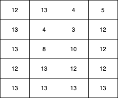
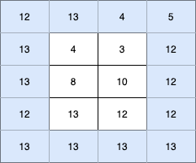
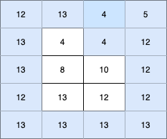
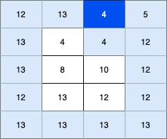
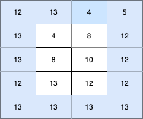
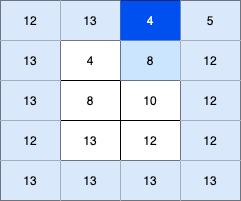
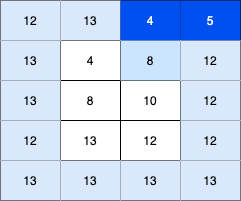
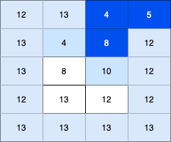

407.接雨水2
----------

 - 题目
> 给你一个 m x n 的矩阵，其中的值均为非负整数，代表二维高度图每个单元的高度，请计算图中形状最多能接多少体积的雨水。
> 
----------
 - 示例
> 输入: heightMap = [[1,4,3,1,3,2],[3,2,1,3,2,4],[2,3,3,2,3,1]]
>
> 输出: 4
>
----------
- 代码
> 错误解：
> 
>
    class Solution:
        def trapRainWater(self, heightMap: List[List[int]]) -> int:
            row = len(heightMap)
            col = len(heightMap[0])
            # [i,j] 向左，右，上，下的最高值
            left = [[-1]*col for _ in range(row)]
            right = [[-1]*col for _ in range(row)]
            up = [[-1]*col for _ in range(row)]
            down = [[-1]*col for _ in range(row)]
            
            for i in range(row):
                h = 0
                for j in range(col):
                    left[i][j] = h
                    if heightMap[i][j]>h:
                        h = heightMap[i][j]
            for i in range(row):
                h = 0
                for j in range(col-1,-1,-1):
                    right[i][j] = h
                    if heightMap[i][j]>h:
                        h = heightMap[i][j]
            for j in range(col):
                h = 0
                for i in range(row):
                    up[i][j] = h
                    if heightMap[i][j]>h:
                        h = heightMap[i][j]
            for j in range(col):
                h = 0
                for i in range(row-1,-1,-1):
                    down[i][j] = h
                    if heightMap[i][j]>h:
                        h = heightMap[i][j]
            
            # print(left,right,up,down)
            # 计算每个位置的蓄水量
            water = 0
            for i in range(1,row-1):
                for j in range(1,col-1):
                    h = heightMap[i][j]
                    lowest = min(left[i][j],right[i][j],up[i][j],down[i][j])
                    # print(h,lowest)
                    water+=(lowest-h) if lowest>h else 0
            return water
> 
> 正确解
> 
    class Solution:
        def trapRainWater(self, heightMap: List[List[int]]) -> int:
            # 少于三行或三列的是没法接水的
            if len(heightMap)<=2 or len(heightMap[0])<=2:
                return 0
            m,n = len(heightMap),len(heightMap[0])
            visited = [[0 for _ in range(n)] for _ in range(m)]
            pq = []
            # 外墙壁先入队
            for i in range(m):
                for j in range(n):
                    if i==0 or i==m-1 or j==0 or j==n-1:
                        visited[i][j] = 1
                        heapq.heappush(pq,(heightMap[i][j],i*n+j))
            
            res = 0
            dirs = [-1,0,1,0,-1]
            while pq:
                # 弹出当前最矮的柱子
                height,position = heapq.heappop(pq)
                # 遍历四个方向
                for k in range(4):
                    nx, ny = position // n + dirs[k], position % n + dirs[k + 1]
                    if nx >= 0 and nx < m and ny >= 0 and ny < n and visited[nx][ny] == 0:
                        if height > heightMap[nx][ny]:
                            res += height - heightMap[nx][ny]
                        visited[nx][ny] = 1    
                        heapq.heappush(pq, (max(height, heightMap[nx][ny]), nx * n + ny))
            return res
             
----------
> 
> 由 42.接雨水 的解答经验，容易联想到用单调栈，但这题和单调栈毛关系没有。。
> 
> 因为在一维的接雨水，实际上可以是本题的特化情况；
> 
> 可以认为，有三行柱子，然后第0行和第二行是无限高的，在求这里面的蓄水高度；（配图）
> 
> 这样的条件下，由于水只会从第二行的左右两头流出，因此可以用单调栈解决；
> 
> 但在本题中，没有上下两头的高墙壁，水流可以沿着路径从外墙（最外面一圈柱子）流出；
> 
----------
>  最初的想法（错误解法）尝试单独求每根柱子处的蓄水量；
> 
> 首先假设每根柱子都有无限水，然后向四面流淌，那么自然，只要四个方向上都存在比当前柱子高的柱子，当前柱子就能蓄水了；蓄水量取决于四个方向上最矮的那个（木桶定理）
> 
> 因此先求四个数组，用来记录每个位置[i,j]上四面比自己高的柱子的高度；（那四个for循环）
> 
> 然后按照上述，求得每个位置的蓄水量；
> 
> 然而这个方法忽略了一点，水流并不是只流向四个方向而不改变（比如，从[5,5]流向[5,4]流向[5,4]流向[4,4]流向[3,4]。。。。）（配图）
> 
----------
>
> 由于正确题解关联迪杰斯特拉算法，但我实在没看出有什么关联。。所以从自己的理解给出解释；
> 
> 首先，为什么要将外墙那一圈要先放入队列，因为水流最终会从外墙流出去，所以得寻找"外墙"中最矮的那个位置，它是出水口；
> 
> 可以看到代码中visited表示已经计算出蓄水结果的位置，外圈先被记录也是因为外圈的位置蓄水一定为0；
> 
> 外圈中找到的最矮位置可能成为内部所有位置的最终出水口，因此要从这个位置开始计算；
> 
> 以下为计算过程：
> 
> 初始状态
> 

>
> 然后将蓄水量为0的外围墙都入队列，它们对应的visited标志为true，浅蓝色
> 

>
> 此时从最低点进入内部，看其相邻那一格是否会蓄水；
> 

>
> 遍历过该点之后，要将该点的值更新为最终状态（蓄水后的高度）；
> 
> 如果该点蓄水，则其高度为 **相邻四根柱子的最终状态中的最矮的那个**；
> 
> 对于这个出水口的相邻位置，只需要考虑它和出水口的高度差。为什么不用考虑该位置的其他三个相邻点[1,1],[1,3],[2,2]呢？
> 
> 因为它们也得从[0,2]这个出水口流出（因为这个口是"外墙"上最矮的出水口），因此，它们蓄水的最高高度也就是[0,2]的高度，因此我们可以更新过[1,2]之后，在后续的流程中计算它们的蓄水高度；
> 
> 填充完该格子[1,2]之后，我们可以将它标记为"外墙"（已经浏览的状态），并将[0,2]这个格子抹去（标记为深蓝色），假设它不存在了；
> 

>
> 
> 之后，我们需要重复上述过程，一直寻找"外墙"上最矮的出水口，总是从这个出水口出发，去求得其相邻点的蓄水量；
> 
> 刚刚考虑的是外墙最矮处的相邻位恰好能蓄水的情况，那如果该位置不能蓄水呢？
> 
> 新的初始状态
> 

>
> 由于出水口的相邻位置不蓄水，但我们仍然将它更新为新的外墙；
> 

> 
> 此时算法会寻找新的最矮出水口，从该处入手再去计算其相邻点的蓄水高度；
> 

>
