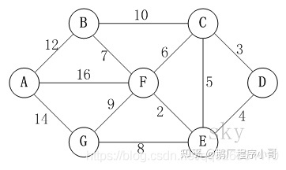
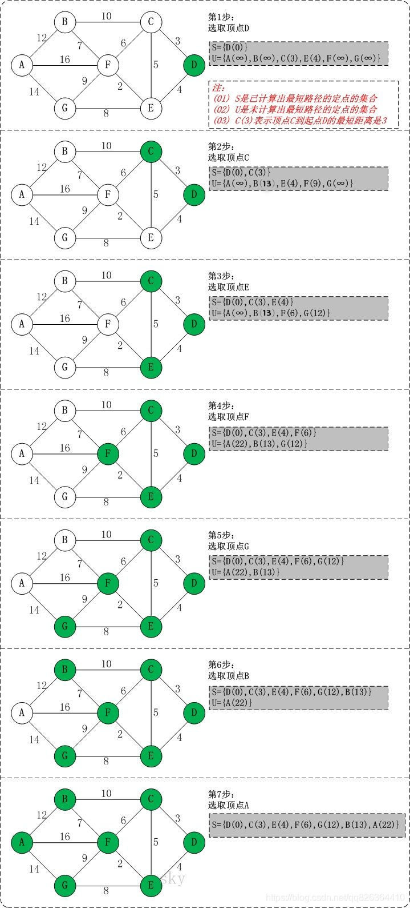

>
> 迪杰斯特拉算法用于求取图中的单源最短路径；
> 

>
> 其更新过程是这样；
> 
> 每次起点能到达的节点，看从该节点能到达的其他节点中，是否有需要更新最短路径的部分；
> 有就去更新它；
> 
> 同时，在每次更新的时候，记录该节点的来源节点，就能记录下从起点到各节点的最短路径经过的节点；
> 
> 
    import heapq

    def dijkstra(start,cost,n):
        # start: 起点
        # cost: 记录各个节点对应边的map
        # n: 节点数量
        # dists数组记录了start到各个节点的距离
        dists = [float('inf')]*n
        # path记录了各最短路径经过的节点，用递归的方式解析可以得到对应路径
        path = [-1]*n'
        dists[start] = 0
        # 用堆记录更新过程中到达的新节点
        heap = [(0,start)]
        while heap:
            cur,_ = heapq.heappop(heap)
            # 从当前这个节点，看其到达的节点是否需要更新最短路径
            for toNode,val in cost[cur].items():
                if dists[toNode]>dists[cur]+val:
                    # 更新最短路径长度
                    dists[toNode] = dists[cur]+val
                    # 记录最短路径
                    path[toNode] = cur
                    heapq.heappush(heap,(dists[toNode],toNode))

        def calMinPath(start,end,path):
            # 求出start到end的最短路径
            node = end
            pathd = []
            while node!=-1:
                pathd.append(node)
                node = path[node]
            return pathd
        return path,dists