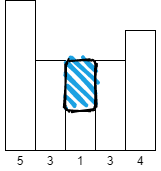
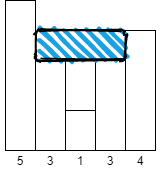

42.接雨水
----------
- 题目
> 给定 n 个非负整数表示每个宽度为 1 的柱子的高度图，计算按此排列的柱子，下雨之后能接多少雨水。
>
----------
- 示例
> input : [0,1,0,2,1,0,1,3,2,1,2,1]
>
> output : 6
----------
 - 代码
>
    class Solution:
        def trap(self, height: List[int]) -> int:
            if len(height)<3:
                return 0
            stack = []
            stack.append(0)
            res = 0
            i = 1
            #for i in range(len(height)):
            while i<len(height):
                # 维护递减栈
                if len(stack)==0 or height[i]<height[stack[-1]]:
                    stack.append(i)
                    i+=1
                # 触发出栈条件
                elif height[i]>=height[stack[-1]]:
                    last = 0
                    # 计算坑里的积水
                    while len(stack)>0 and height[stack[-1]]<=height[i]:
                        #print(last)
                        left = stack.pop()
                        res+=(height[left]-last)*(i-left-1)
                        last = height[left]
                    stack.append(i)
                    if len(stack)>1:
                        #print(stack,i)
                        res+=(height[i]-last)*(i-stack[-2]-1)
                    i+=1
            return res

----------
- 解析
> 这题是典型的单调栈应用，而且结合生活，可以很容易理解；
>
> 首先我们知道，路面有坑才能积水，坑是凹形的；
>
> 所以用单调递减栈，**单调递减栈的pop触发条件正是遇到凹形**；
>
> 由于每个坑的积水都要被计算，因此，在每次触发条件达成的while循环里面，计算该凹形部分所得的积水；
>
    while len(stack)>0 and height[stack[-1]]<=height[i]:
        #print(last)
        left = stack.pop()
        res+=(height[left]-last)*(i-left-1)
        last = height[left]
> 这里的left是每次pop出来的height索引，所以while循环每次会计算，高度为height[i]的凹形所得到的积水量；
>
> 由于该凹形所包含的凹形的积水，上一轮已经计算过了，所以这里要以last（上一轮的最大高度）为最小高度
>
>
> 举个例子，[5,3,1,3,4] 的凹形，在将4 pop出来时，由于[3,1,3]的凹形积水量已经计算过了，所以该轮计算的积水量为 (4-3)*(4-0-1)
>
>

> 先计算这个部分
>

> 下一轮时，上一轮已经计算过的那个坑不再计算，因此最小高度为last
>
> 最后还要加上，height[current]为高度所得到的积水量，也就是最上面那层的积水量；
>
    if len(stack)>1:
        res+=(height[i]-last)*(i-stack[-2]-1)