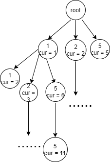

> 以322.零钱兑换为例
>
> 这里最容易想到的应该是将所有可能的硬币组合都列举出来，然后找出其中使用硬币最少的一个；
>
> 即是**深度优先搜索** 

    def dfs(cur,temp,res):
        if cur==amount:
            res.append(temp.copy())
        # 穷举所有硬币组合
        for coin in coins:
            # 只有当前的硬币总额小于目标额度的时候，才可以继续进行
            if cur+coin<=amount:
                cur+=coin
                temp.append(coin)
                dfs(cur,temp,res)
                temp.pop()
                cur-=coin
        res = []
        dfs(0,[],res)

> 但是在本问题中，由于硬币是无限使用的，所以要穷举所有的可能，就会产生很深的搜索树；
>
> 

> 
> 从图中可以看出，算法将计算cur=11的叶节点的个数;
>
> 以本题给的示例为例，coints = [1,2,5],amount = 11时，
>
> 就有218种硬币组合;
>
> 算法的复杂度将是指数级的；
>
----------

> 由于dfs每次都是由根节点到叶节点的一次搜索过程，这个过程可以用记忆集进行简化；
>
    # 记忆集，用于记录组成目标值所使用的最少硬币数量
    memory = {}
    def dfs(cur,temp,res):
        # 如果当前cur未被记录或者是当前组合方案使用的硬币数量比之前记录的要更少，则更新记忆集
        if cur not in memory or len(temp)<memory[cur]:
            memory[cur] = len(temp)
        for coin in coins:
            if cur+coin<=amount:
                cur+=coin
                temp.append(coin)
                # 剪枝
                if cur not in memory or len(temp)<memory[cur]:
                    dfs(cur,temp,res)
                temp.pop()
                cur-=coin
    res = []
    dfs(0,[],res)
    print(memory)
    return 0
        
> 这样可以大幅减少深度优先搜索的次数，因为从上面那棵树来看，dfs会左往右依次遍历各个节点；
> 
> 如果两个节点p和q，二者对应的cur值一样，并且p在q的左边，且p的深度小于q，那么q对应的分支将不会被遍历(因为p对应的是更优的方案）；
>
> 如此一来，复杂度将大幅减小（对于特殊情况，就是更深的节点都在左边的话，复杂度并没有减小）；
>

----------

> 对于此题，还可以从另外一个角度来解释；
>
> 以极端情况来考虑，如果coins=[1]，那么显然，要得到amount = x只有一种方案，就是用x个 1元的硬币；
>
> 那么此时如果加入 2元硬币，使coins = [1,2];
>
> 此时假设x=3，那么方案[1,2]将会比[1,1,1]少使用一个硬币，同理，x=5，方案[1,1,1,2]会比方案[1,1,1,1,1]少使用一个硬币；方案[1,2,2]又少一个；
>
> 可以看到，x=5的最优方案是由x=3的最优方案[1,2]+[2]得到，即可以说它取决于x=3的最佳方案以及你是否有2元的硬币；
>
> **即最优结构取决于最优的子结构**；
>
> 我们可以定义 dp[5] = dp[3]+fun(coins)，当然这里的dp[5]也可以取决于dp[4],因为dp[4]为[2,2]，加上一个[1]也等于dp[5]；
>
> 可以定义转移公式 dp[x] = fun(dp[x-coin],coin)
>
> 所以此时，只需要每次加入新的硬币，依据转移公式更新dp数组即可；
>
    for coin in coins:
        for num in range(coin,amount+1):
            # 状态转移公式
            dp[num] = min(dp[num],dp[num-coin]+1)
            
> 如果将dp数组打印出来，就会发现，和上面使用记忆集的dfs中的memory记录的是相同的东西，
> 即dp[i]记录的是，用最少数量的硬币组成i 所需要的硬币数量；